# Microfrontend Setup Guide - Complete Tutorial

This comprehensive guide walks you through building a microfrontend e-commerce application from scratch using Webpack Module Federation, React, Vue 3, and RxJS.

## Table of Contents

1. [Prerequisites](#prerequisites)
2. [Project Structure](#project-structure)
3. [Shared Library Setup](#shared-library-setup)
4. [Container App Setup](#container-app-setup)
5. [Products Microfrontend (Vue.js)](#products-microfrontend-vuejs)
6. [Cart Microfrontend (React)](#cart-microfrontend-react)
7. [Auth Microfrontend (React)](#auth-microfrontend-react)
8. [Module Federation Configuration](#module-federation-configuration)
9. [RxJS Global Store Implementation](#rxjs-global-store-implementation)
10. [Testing & Deployment](#testing--deployment)

---

## Prerequisites

### Required Software

```bash
# Node.js (Version 16+)
node --version  # Should be 16.0.0+

# NPM
npm --version   # Should be 8.0.0+

# Git
git --version
```

### Knowledge Requirements
- Basic JavaScript/TypeScript
- React fundamentals
- Vue.js basics (for Products app)
- Webpack basics
- npm/package.json understanding

---

## Project Structure

### 1. Create Root Directory

```bash
mkdir microfrontend-ecommerce
cd microfrontend-ecommerce

# Initialize root package.json
npm init -y
```

### 2. Create Folder Structure

```bash
mkdir container products cart auth shared
mkdir scripts

# Your structure should look like:
```

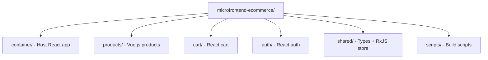

---

## Shared Library Setup

The shared library provides types, utilities, and the centralized RxJS Global Store.

### 1. Initialize Shared Library

```bash
cd shared
npm init -y
```

### 2. Install Dependencies

```bash
npm install rxjs axios
npm install --save-dev typescript @types/node rimraf
```

### 3. Create package.json

```json
{
  "name": "@microfrontend-ecommerce/shared",
  "version": "1.0.0",
  "main": "dist/index.js",
  "types": "dist/index.d.ts",
  "scripts": {
    "build": "tsc",
    "dev": "tsc --watch",
    "clean": "rimraf dist"
  },
  "dependencies": {
    "rxjs": "^7.8.0",
    "axios": "^1.6.0"
  },
  "devDependencies": {
    "typescript": "^5.2.0",
    "rimraf": "^5.0.0",
    "@types/node": "^20.0.0"
  },
  "files": ["dist"]
}
```

### 4. TypeScript Configuration (tsconfig.json)

```json
{
  "compilerOptions": {
    "target": "es2020",
    "lib": ["es2020", "dom"],
    "module": "esnext",
    "moduleResolution": "node",
    "declaration": true,
    "outDir": "./dist",
    "rootDir": "./src",
    "strict": true,
    "esModuleInterop": true,
    "skipLibCheck": true,
    "forceConsistentCasingInFileNames": true,
    "resolveJsonModule": true,
    "allowSyntheticDefaultImports": true
  },
  "include": ["src/**/*"],
  "exclude": ["node_modules", "dist"]
}
```

### 5. Create Core Types (src/types/index.ts)

```typescript
export interface User {
  id: number;
  email: string;
  username: string;
  password: string;
  name: {
    firstname: string;
    lastname: string;
  };
  address: {
    city: string;
    street: string;
    number: number;
    zipcode: string;
    geolocation: {
      lat: string;
      long: string;
    };
  };
  phone: string;
}

export interface Product {
  id: number;
  title: string;
  price: number;
  description: string;
  category: string;
  image: string;
  rating: {
    rate: number;
    count: number;
  };
}

export interface CartItem {
  productId: number;
  quantity: number;
}

export interface LoginCredentials {
  username: string;
  password: string;
}

export interface AuthResponse {
  token: string;
}
```

### 6. Create RxJS Global Store (src/store/GlobalStore.ts)

```typescript
import { BehaviorSubject, Observable, map, distinctUntilChanged } from "rxjs";
import { CartItem, Product, User } from "../types";

export interface GlobalState {
  cart: CartItem[];
  user: User | null;
  products: Product[];
  loading: boolean;
  error: string | null;
}

export type GlobalAction =
  | { type: "SET_LOADING"; payload: boolean }
  | { type: "SET_ERROR"; payload: string | null }
  | { type: "SET_USER"; payload: User | null }
  | { type: "SET_PRODUCTS"; payload: Product[] }
  | { type: "ADD_TO_CART"; payload: { product: Product; quantity: number } }
  | { type: "REMOVE_FROM_CART"; payload: number }
  | { type: "UPDATE_CART_QUANTITY"; payload: { productId: number; quantity: number } }
  | { type: "CLEAR_CART" }
  | { type: "LOAD_CART"; payload: CartItem[] };

const initialState: GlobalState = {
  cart: [],
  user: null,
  products: [],
  loading: false,
  error: null,
};

export class GlobalStore {
  private static instance: GlobalStore;
  private state$ = new BehaviorSubject<GlobalState>(initialState);
  private storageKey = "microfrontend-global-state";

  protected constructor() {
    this.loadFromStorage();
    this.setupStoragePersistence();
  }

  public static getInstance(): GlobalStore {
    if (!GlobalStore.instance) {
      GlobalStore.instance = new GlobalStore();
    }
    return GlobalStore.instance;
  }

  getState(): GlobalState {
    return this.state$.value;
  }

  getState$(): Observable<GlobalState> {
    return this.state$.asObservable();
  }

  select<K extends keyof GlobalState>(key: K): Observable<GlobalState[K]> {
    return this.state$.pipe(
      map((state) => state[key]),
      distinctUntilChanged()
    );
  }

  dispatch(action: GlobalAction): void {
    const currentState = this.state$.value;
    const newState = this.reducer(currentState, action);
    this.state$.next(newState);
  }

  // Convenience methods
  addToCart(product: Product, quantity: number = 1): void {
    this.dispatch({ type: "ADD_TO_CART", payload: { product, quantity } });
  }

  removeFromCart(productId: number): void {
    this.dispatch({ type: "REMOVE_FROM_CART", payload: productId });
  }

  updateCartQuantity(productId: number, quantity: number): void {
    this.dispatch({ type: "UPDATE_CART_QUANTITY", payload: { productId, quantity } });
  }

  clearCart(): void {
    this.dispatch({ type: "CLEAR_CART" });
  }

  setUser(user: User | null): void {
    this.dispatch({ type: "SET_USER", payload: user });
  }

  setProducts(products: Product[]): void {
    this.dispatch({ type: "SET_PRODUCTS", payload: products });
  }

  private reducer(state: GlobalState, action: GlobalAction): GlobalState {
    switch (action.type) {
      case "SET_LOADING":
        return { ...state, loading: action.payload };
      case "SET_ERROR":
        return { ...state, error: action.payload };
      case "SET_USER":
        return { ...state, user: action.payload };
      case "SET_PRODUCTS":
        return { ...state, products: action.payload };
      case "ADD_TO_CART": {
        const existingIndex = state.cart.findIndex(
          (item) => item.productId === action.payload.product.id
        );
        if (existingIndex >= 0) {
          return {
            ...state,
            cart: state.cart.map((item, index) =>
              index === existingIndex
                ? { ...item, quantity: item.quantity + action.payload.quantity }
                : item
            ),
          };
        } else {
          return {
            ...state,
            cart: [...state.cart, { productId: action.payload.product.id, quantity: action.payload.quantity }],
          };
        }
      }
      case "REMOVE_FROM_CART":
        return {
          ...state,
          cart: state.cart.filter((item) => item.productId !== action.payload),
        };
      case "UPDATE_CART_QUANTITY":
        return {
          ...state,
          cart: state.cart
            .map((item) =>
              item.productId === action.payload.productId
                ? { ...item, quantity: action.payload.quantity }
                : item
            )
            .filter((item) => item.quantity > 0),
        };
      case "CLEAR_CART":
        return { ...state, cart: [] };
      case "LOAD_CART":
        return { ...state, cart: action.payload };
      default:
        return state;
    }
  }

  private loadFromStorage(): void {
    try {
      const stored = localStorage.getItem(this.storageKey);
      if (stored) {
        const parsedState = JSON.parse(stored);
        this.dispatch({ type: "LOAD_CART", payload: parsedState.cart || [] });
        if (parsedState.user) {
          this.dispatch({ type: "SET_USER", payload: parsedState.user });
        }
      }
    } catch (error) {
      console.error("Failed to load from storage:", error);
    }
  }

  private setupStoragePersistence(): void {
    this.state$.subscribe((state) => {
      try {
        const persistentState = {
          cart: state.cart,
          user: state.user,
        };
        localStorage.setItem(this.storageKey, JSON.stringify(persistentState));
      } catch (error) {
        console.error("Failed to persist state:", error);
      }
    });
  }
}

export const globalStore = GlobalStore.getInstance();
```

### 7. Create Storage Utilities (src/utils/index.ts)

```typescript
export const storage = {
  get: (key: string): any => {
    try {
      const item = localStorage.getItem(key);
      return item ? JSON.parse(item) : null;
    } catch (error) {
      console.error(`Storage get error for key "${key}":`, error);
      return null;
    }
  },

  set: (key: string, value: any) => {
    try {
      localStorage.setItem(key, JSON.stringify(value));
    } catch (error) {
      console.error(`Storage set error for key "${key}":`, error);
    }
  },

  remove: (key: string) => {
    try {
      localStorage.removeItem(key);
    } catch (error) {
      console.error(`Storage remove error for key "${key}":`, error);
    }
  }
};
```

### 8. Create API Functions (src/api/index.ts)

```typescript
import axios from 'axios';
import { LoginCredentials, AuthResponse, Product } from '../types';

const API_BASE = 'https://fakestoreapi.com';

export const authApi = {
  login: async (credentials: LoginCredentials): Promise<AuthResponse> => {
    const response = await axios.post(`${API_BASE}/auth/login`, credentials);
    return response.data;
  }
};

export const productsApi = {
  getAll: async (): Promise<Product[]> => {
    const response = await axios.get(`${API_BASE}/products`);
    return response.data;
  },
  
  getProduct: async (id: number): Promise<Product> => {
    const response = await axios.get(`${API_BASE}/products/${id}`);
    return response.data;
  }
};
```

### 9. Create Main Export (src/index.ts)

```typescript
// Export all types
export * from './types';

// Export all API functions
export * from './api';

// Export all utilities
export * from './utils';

// Export RxJS Global Store
export { GlobalStore, globalStore } from './store/GlobalStore';
```

---

## Container App Setup

The container app serves as the host application that loads and orchestrates all microfrontends.

### 1. Initialize Container

```bash
cd ../container
npm init -y
```

### 2. Install Dependencies

```bash
# React dependencies
npm install react react-dom react-router-dom

# Development dependencies
npm install --save-dev @types/react @types/react-dom typescript webpack webpack-cli webpack-dev-server html-webpack-plugin babel-loader @babel/core @babel/preset-react @babel/preset-typescript css-loader style-loader postcss-loader tailwindcss autoprefixer

# Local shared library
npm install ../shared
```

### 3. Create package.json

```json
{
  "name": "@microfrontend-ecommerce/container",
  "version": "1.0.0",
  "scripts": {
    "start": "webpack serve --mode=development",
    "build": "webpack --mode=production",
    "type-check": "tsc --noEmit"
  },
  "dependencies": {
    "react": "^18.2.0",
    "react-dom": "^18.2.0",
    "react-router-dom": "^6.8.0",
    "@microfrontend-ecommerce/shared": "file:../shared"
  }
}
```

### 4. Webpack Configuration (webpack.config.js)

```javascript
const HtmlWebpackPlugin = require('html-webpack-plugin');
const { ModuleFederationPlugin } = require('webpack').container;

module.exports = (env = {}, argv = {}) => {
  const isProd = argv.mode === 'production';

  return {
    mode: isProd ? 'production' : 'development',
    entry: './src/index.tsx',
    devServer: {
      port: 3000,
      historyApiFallback: true,
      headers: {
        'Access-Control-Allow-Origin': '*',
      },
    },
    resolve: {
      extensions: ['.tsx', '.ts', '.js'],
    },
    module: {
      rules: [
        {
          test: /\.(js|jsx|ts|tsx)$/,
          exclude: /node_modules/,
          use: {
            loader: 'babel-loader',
            options: {
              presets: ['@babel/preset-react', '@babel/preset-typescript'],
            },
          },
        },
        {
          test: /\.css$/i,
          use: ['style-loader', 'css-loader', 'postcss-loader'],
        },
      ],
    },
    plugins: [
      new ModuleFederationPlugin({
        name: 'container',
        remotes: isProd
          ? {
              products: 'products@/products/remoteEntry.js',
              cart: 'cart@/cart/remoteEntry.js',
              auth: 'auth@/auth/remoteEntry.js',
            }
          : {
              products: 'products@http://localhost:3001/remoteEntry.js',
              cart: 'cart@http://localhost:3002/remoteEntry.js',
              auth: 'auth@http://localhost:3003/remoteEntry.js',
            },
        shared: {
          react: { singleton: true, eager: false, requiredVersion: '^18.2.0' },
          'react-dom': { singleton: true, eager: false, requiredVersion: '^18.2.0' },
          'react-router-dom': { singleton: true, eager: false, requiredVersion: '^6.8.0' },
          '@microfrontend-ecommerce/shared': { singleton: true, eager: false },
        },
      }),
      new HtmlWebpackPlugin({
        template: './public/index.html',
      }),
    ],
  };
};
```

### 5. Container Architecture

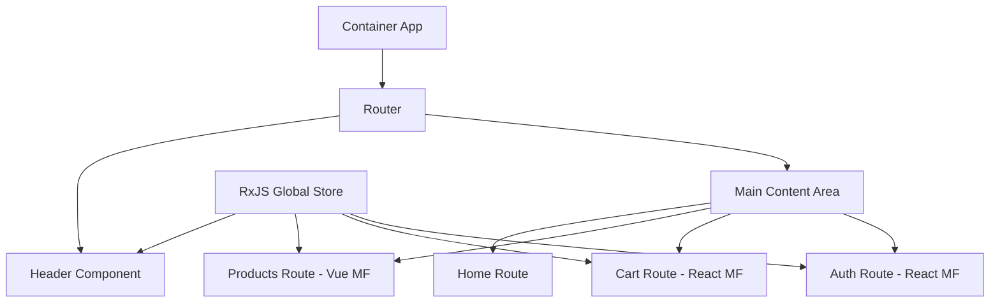

### 6. Create Container Components

**public/index.html:**
```html
<!DOCTYPE html>
<html lang="en">
<head>
    <meta charset="UTF-8">
    <meta name="viewport" content="width=device-width, initial-scale=1.0">
    <title>Microfrontend E-commerce</title>
    <script src="https://cdn.tailwindcss.com"></script>
</head>
<body>
    <div id="root"></div>
</body>
</html>
```

**src/App.tsx:**
```tsx
import React from 'react';
import { BrowserRouter as Router, Routes, Route } from 'react-router-dom';
import { AppProvider } from './context/AppContextRxJS';
import Header from './components/Header';
import Home from './pages/Home';
import ErrorBoundary from './components/ErrorBoundary';

// Lazy load microfrontends
const RemoteProductsApp = React.lazy(() => import('./components/RemoteProductsApp'));
const RemoteCartApp = React.lazy(() => import('./components/RemoteCartApp'));
const RemoteAuthApp = React.lazy(() => import('./components/RemoteAuthApp'));

function App() {
  return (
    <AppProvider>
      <Router>
        <div className="min-h-screen bg-gray-50">
          <Header />
          <main className="max-w-7xl mx-auto px-4 sm:px-6 lg:px-8 py-8">
            <React.Suspense fallback={<div>Loading...</div>}>
              <Routes>
                <Route path="/" element={<Home />} />
                <Route
                  path="/products/*"
                  element={
                    <ErrorBoundary microfrontendName="Products">
                      <RemoteProductsApp />
                    </ErrorBoundary>
                  }
                />
                <Route
                  path="/cart/*"
                  element={
                    <ErrorBoundary microfrontendName="Cart">
                      <RemoteCartApp />
                    </ErrorBoundary>
                  }
                />
                <Route
                  path="/auth/*"
                  element={
                    <ErrorBoundary microfrontendName="Auth">
                      <RemoteAuthApp />
                    </ErrorBoundary>
                  }
                />
              </Routes>
            </React.Suspense>
          </main>
        </div>
      </Router>
    </AppProvider>
  );
}

export default App;
```

---

## Products Microfrontend (Vue.js)

### 1. Initialize Products App

```bash
cd ../products
npm init -y
```

### 2. Install Dependencies

```bash
# Vue dependencies
npm install vue@^3.3.4 vue-router@^4.2.4 pinia@^2.1.6

# Development dependencies
npm install --save-dev @vitejs/plugin-vue typescript webpack webpack-cli webpack-dev-server html-webpack-plugin vue-loader css-loader style-loader ts-loader

# Shared library
npm install ../shared
```

### 3. Webpack Configuration

```javascript
const { VueLoaderPlugin } = require('vue-loader');
const { ModuleFederationPlugin } = require('webpack').container;

module.exports = {
  entry: './src/bootstrap.ts',
  mode: 'development',
  devServer: {
    port: 3001,
    headers: {
      'Access-Control-Allow-Origin': '*',
    },
  },
  resolve: {
    extensions: ['.tsx', '.ts', '.vue', '.js'],
  },
  module: {
    rules: [
      {
        test: /\.vue$/,
        loader: 'vue-loader',
      },
      {
        test: /\.tsx?$/,
        loader: 'ts-loader',
        options: {
          appendTsSuffixTo: [/\.vue$/],
        },
        exclude: /node_modules/,
      },
      {
        test: /\.css$/i,
        use: ['style-loader', 'css-loader'],
      },
    ],
  },
  plugins: [
    new VueLoaderPlugin(),
    new ModuleFederationPlugin({
      name: 'products',
      filename: 'remoteEntry.js',
      exposes: {
        './App': './src/App.vue',
      },
      shared: {
        vue: { singleton: true, eager: false, requiredVersion: '^3.3.4' },
        'vue-router': { singleton: true, eager: false, requiredVersion: '^4.2.4' },
        pinia: { singleton: true, eager: false, requiredVersion: '^2.1.6' },
        '@microfrontend-ecommerce/shared': { singleton: true, eager: false },
      },
    }),
  ],
};
```

### 4. Vue App Structure

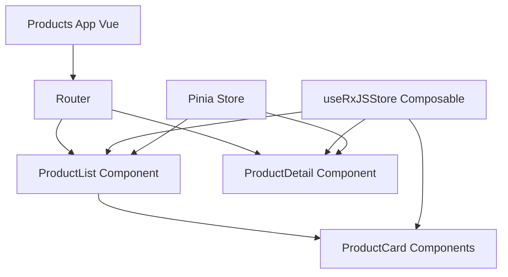

---

## Cart Microfrontend (React)

### 1. Initialize Cart App

```bash
cd ../cart
npm init -y
```

### 2. Install Dependencies

```bash
npm install react react-dom
npm install --save-dev @types/react @types/react-dom typescript webpack webpack-cli webpack-dev-server babel-loader @babel/core @babel/preset-react @babel/preset-typescript css-loader style-loader html-webpack-plugin

npm install ../shared
```

### 3. Cart Architecture

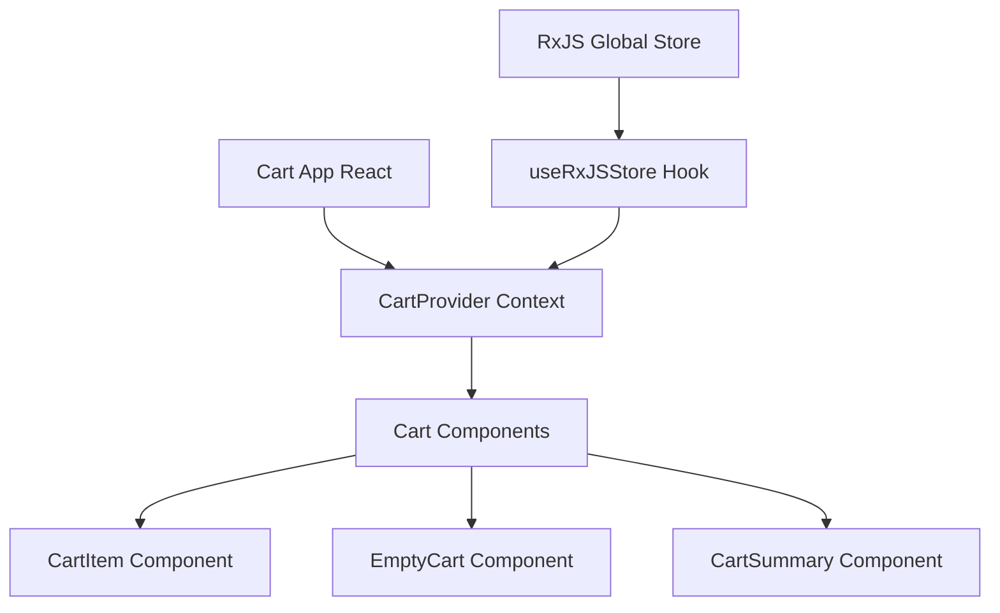

---

## Auth Microfrontend (React)

### 1. Initialize Auth App

```bash
cd ../auth
npm init -y
```

### 2. Auth Flow Architecture

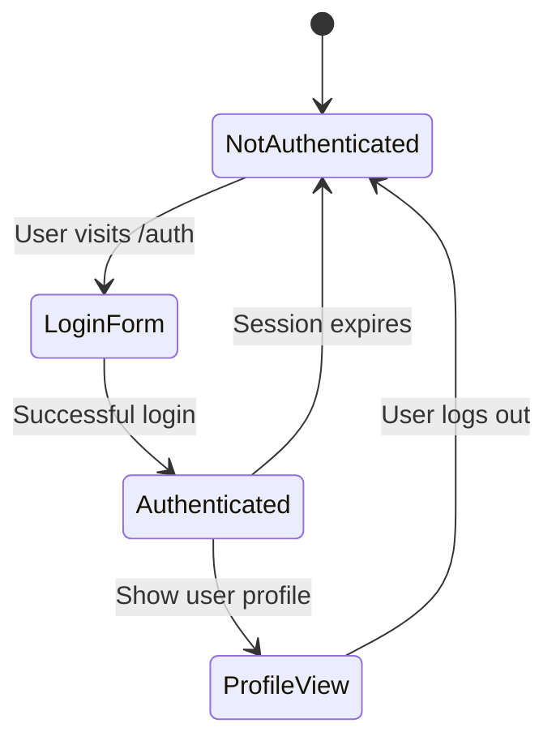

---

## Module Federation Configuration

### Key Concepts

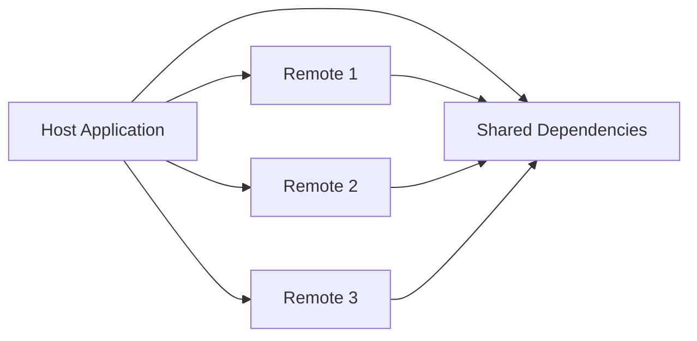

### Configuration Best Practices

1. **Host Application (Container):**
   - Consumes other microfrontends
   - Provides routing and layout
   - Manages shared dependencies

2. **Remote Applications (Products, Cart, Auth):**
   - Expose components/apps
   - Developed independently
   - Have their own webpack dev server

3. **Shared Dependencies:**
   - Prevent duplicate libraries
   - Ensure version compatibility
   - Optimize bundle size

---

## RxJS Global Store Implementation

### Store Architecture

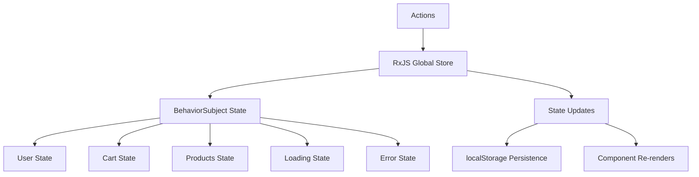

### React Integration

```typescript
// React hook for Container and Cart microfrontends
import { useState, useEffect } from 'react';
import { globalStore } from '@microfrontend-ecommerce/shared';

export const useGlobalSelector = <K extends keyof GlobalState>(key: K) => {
  const [value, setValue] = useState(globalStore.getState()[key]);

  useEffect(() => {
    const subscription = globalStore.select(key).subscribe(setValue);
    return () => subscription.unsubscribe();
  }, [key]);

  return value;
};
```

### Vue Integration

```typescript
// Vue composable for Products microfrontend
import { ref, onMounted, onUnmounted } from 'vue';
import { globalStore } from '@microfrontend-ecommerce/shared';

export const useGlobalStore = () => {
  const state = ref(globalStore.getState());
  let unsubscribe: (() => void) | null = null;

  onMounted(() => {
    unsubscribe = globalStore.subscribe((newState) => {
      state.value = newState;
    });
  });

  onUnmounted(() => {
    if (unsubscribe) {
      unsubscribe();
    }
  });

  return { state };
};
```

---

## Communication Flow

### Cross-Microfrontend State Updates

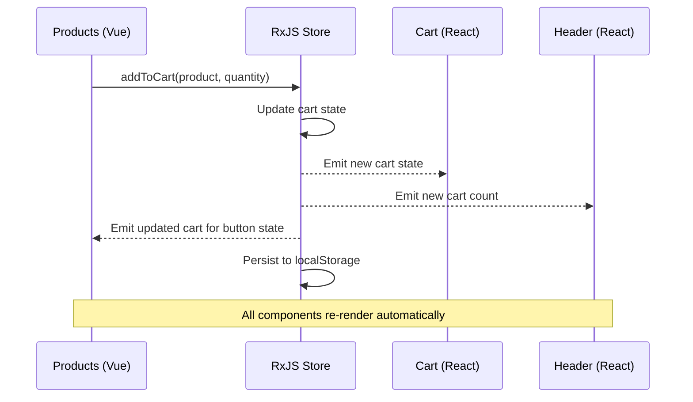

---

## Testing & Deployment

### 1. Development Testing

```bash
# Start all services
npm run dev

# Test in browser
open http://localhost:3000
```

### 2. Production Build

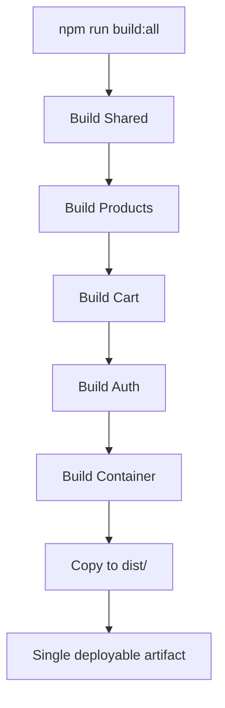

### 3. Deployment Architecture

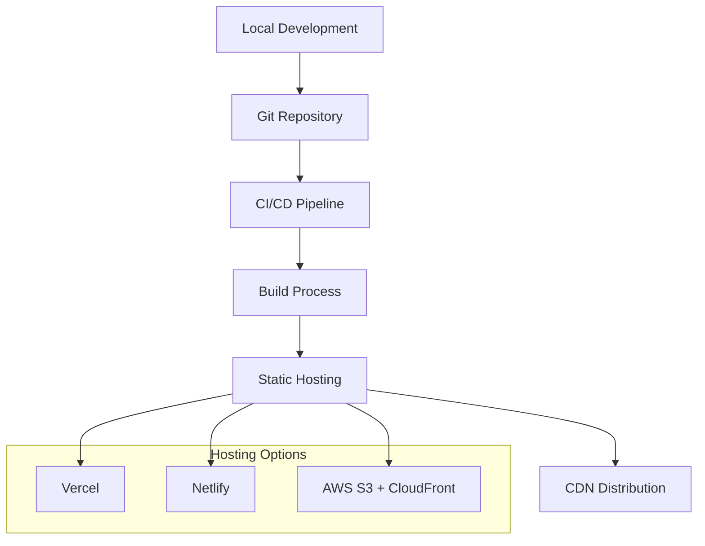

### 4. Vercel Configuration (vercel.json)

```json
{
  "version": 2,
  "buildCommand": "npm run build:all",
  "outputDirectory": "dist",
  "installCommand": "npm run install:all",
  "rewrites": [
    { "source": "/products", "destination": "/index.html" },
    { "source": "/cart", "destination": "/index.html" },
    { "source": "/auth", "destination": "/index.html" },
    { "source": "/products/(.*)\\.js", "destination": "/products/$1.js" },
    { "source": "/cart/(.*)\\.js", "destination": "/cart/$1.js" },
    { "source": "/auth/(.*)\\.js", "destination": "/auth/$1.js" },
    { "source": "/products/(.*)", "destination": "/index.html" },
    { "source": "/cart/(.*)", "destination": "/index.html" },
    { "source": "/auth/(.*)", "destination": "/index.html" },
    { "source": "/(.*)", "destination": "/index.html" }
  ],
  "headers": [
    {
      "source": "/(.*\\.js)",
      "headers": [
        {
          "key": "Content-Type",
          "value": "application/javascript; charset=utf-8"
        },
        {
          "key": "Access-Control-Allow-Origin",
          "value": "*"
        }
      ]
    }
  ],
  "cleanUrls": true,
  "trailingSlash": false
}
```

---

## Advanced Topics

### Error Boundaries

```typescript
class MicrofrontendErrorBoundary extends React.Component {
  state = { hasError: false };

  static getDerivedStateFromError(error: Error) {
    return { hasError: true };
  }

  componentDidCatch(error: Error, errorInfo: React.ErrorInfo) {
    console.error('Microfrontend Error:', error, errorInfo);
  }

  render() {
    if (this.state.hasError) {
      return (
        <div className="error-fallback">
          <h2>Something went wrong with this microfrontend.</h2>
          <button onClick={() => this.setState({ hasError: false })}>
            Try again
          </button>
        </div>
      );
    }

    return this.props.children;
  }
}
```

### Performance Optimization

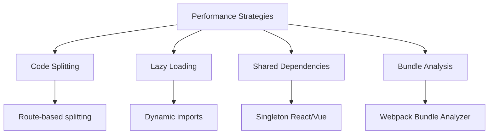

---

## Troubleshooting

### Common Issues

1. **CORS Errors:**
   ```javascript
   headers: {
     'Access-Control-Allow-Origin': '*',
   }
   ```

2. **Module Not Found:**
   ```bash
   cd shared && npm run build
   ```

3. **Version Conflicts:**
   ```javascript
   shared: {
     react: { singleton: true, strictVersion: true }
   }
   ```

4. **State Not Syncing:**
   - Verify globalStore.dispatch() calls
   - Check RxJS subscriptions
   - Ensure proper hook/composable usage

### Debug Checklist

- [ ] All microfrontends running on correct ports
- [ ] Shared library built successfully
- [ ] No console errors in browser
- [ ] Network tab shows successful remoteEntry.js loads
- [ ] RxJS store receives actions
- [ ] localStorage contains persisted state

---

## Success Checklist

- [ ] Project structure created
- [ ] Shared library setup and building
- [ ] Container app running (Port 3000)
- [ ] Products app running (Port 3001)
- [ ] Cart app running (Port 3002)
- [ ] Auth app running (Port 3003)
- [ ] Module Federation working
- [ ] RxJS Global Store implemented
- [ ] Cross-app communication working
- [ ] State persistence working
- [ ] Production build successful
- [ ] Deployment working

---

## Next Steps

### Advanced Features

1. **Add Testing Framework:**
   ```bash
   npm install --save-dev jest @testing-library/react @testing-library/vue
   ```

2. **Add Performance Monitoring:**
   ```typescript
   // Monitor microfrontend loading times
   performance.mark('mf-start');
   // Load microfrontend
   performance.mark('mf-end');
   performance.measure('mf-load', 'mf-start', 'mf-end');
   ```

3. **Add CI/CD Pipeline:**
   ```yaml
   # .github/workflows/deploy.yml
   name: Deploy
   on:
     push:
       branches: [main]
   jobs:
     deploy:
       runs-on: ubuntu-latest
       steps:
         - uses: actions/checkout@v2
         - name: Setup Node
           uses: actions/setup-node@v2
           with:
             node-version: '18'
         - name: Install and Build
           run: |
             npm run install:all
             npm run build:all
         - name: Deploy to Vercel
           uses: amondnet/vercel-action@v20
   ```

### Scaling Considerations

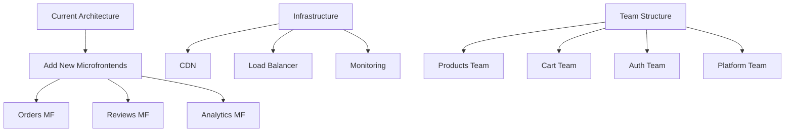

---

## Resources

### Documentation
- [Module Federation Docs](https://webpack.js.org/concepts/module-federation/)
- [RxJS Guide](https://rxjs.dev/)
- [React 18 Features](https://reactjs.org/blog/2022/03/29/react-v18.html)
- [Vue 3 Composition API](https://vuejs.org/guide/composition-api-introduction.html)

### Best Practices
- Keep microfrontends small and focused
- Share state, not components
- Handle errors gracefully
- Monitor performance
- Test integration points
- Document communication contracts

---

## Conclusion

You now have a complete understanding of how to build a production-ready microfrontend application. This architecture provides:

- Independent development and deployment
- Technology diversity (React + Vue)
- Centralized state management
- Real-time cross-app communication
- Production deployment strategies

The combination of Module Federation, RxJS, and proper microfrontend patterns creates a scalable, maintainable architecture suitable for large teams and complex applications.