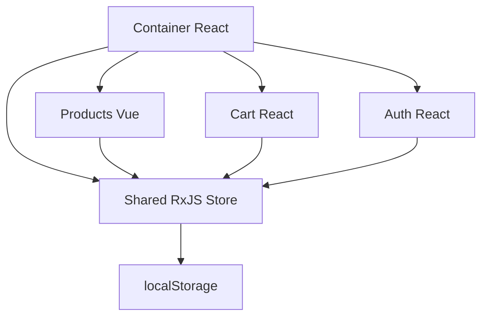
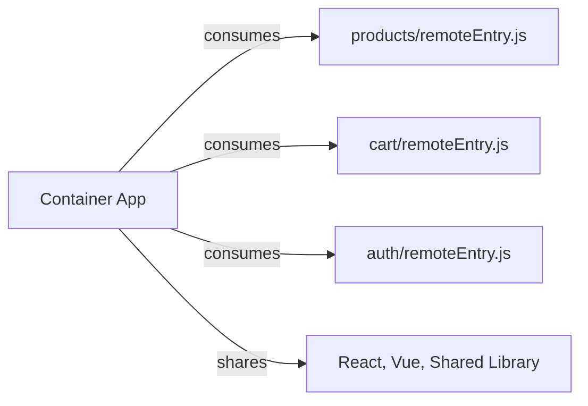
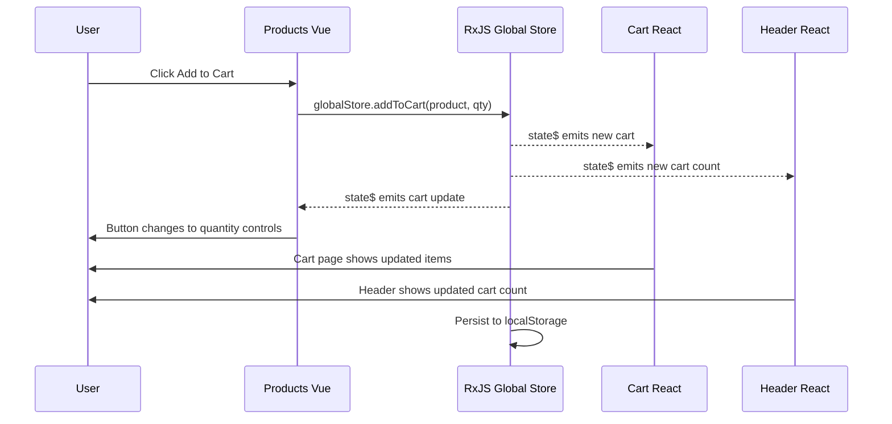
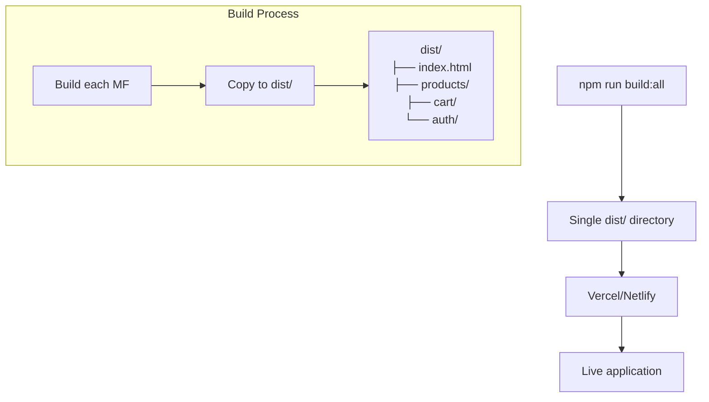
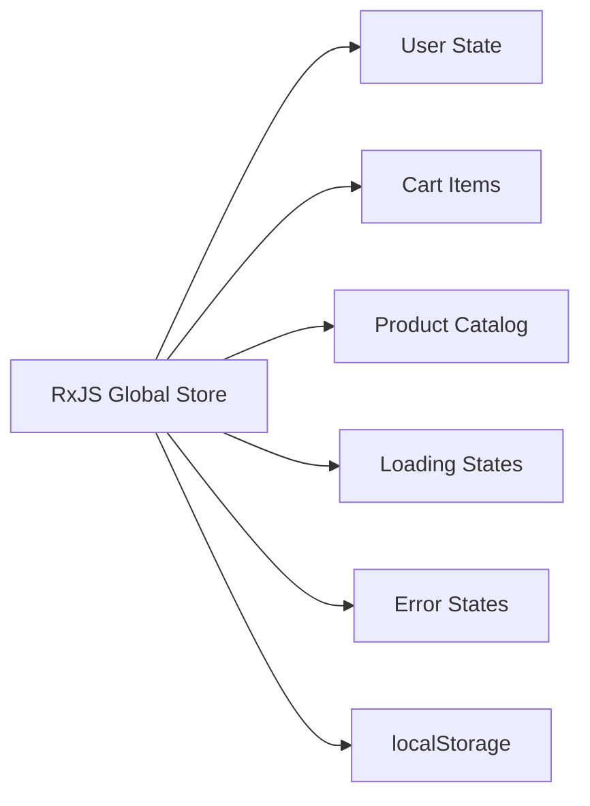

# Microfrontend E-commerce Platform

A production-ready microfrontend e-commerce application built with Webpack Module Federation, React, Vue 3, TypeScript, and an RxJS Global Store for cross-microfrontend state management.

## Overview

This project demonstrates a modern microfrontend architecture where multiple independent frontend applications work together to create a unified e-commerce experience:

- **Container (React)** - Host application providing routing, layout, and composition
- **Products (Vue 3)** - Product catalog and details
- **Cart (React)** - Shopping cart and checkout flow
- **Auth (React)** - Authentication and user profile
- **Shared** - Types, utilities, and the centralized RxJS Global Store

State is centralized in the Shared package and persisted to localStorage. All microfrontends subscribe to the same reactive store and update in real-time.

## Architecture



### Runtime Integration (Module Federation)



## Data Flow



## Key Features

### Products Microfrontend
- Product listing with responsive cards
- Product detail views
- Smart Add to Cart buttons that transform into quantity controls
- Category filtering and search
- Vue 3 Composition API with reactive state

### Cart Microfrontend
- Add/remove items with real-time updates
- Quantity management with +/- controls
- Automatic price calculation
- Clear all functionality
- Persistent cart state

### Auth Microfrontend
- User login/logout with session management
- User profile display with stats
- Secure authentication flow
- Profile view with user information

### Global Features
- Real-time cross-microfrontend communication
- Centralized state management with RxJS
- Automatic data persistence
- Error boundaries and graceful fallbacks

## Smart UI Enhancement

The application features intelligent UI that adapts based on cart state:

```
Product NOT in cart: [ Add to Cart ]
Product IN cart:     [ - ] [ 2 ] [ + ]
                         ↑    ↑   ↑
                    Decrease │ Increase
                           Current Qty
```

This provides immediate feedback and eliminates the need to navigate to the cart page for quantity adjustments.

## Technology Stack

### Frontend Frameworks
- **React 18** - Container, Cart, Auth microfrontends
- **Vue 3** - Products microfrontend with Composition API
- **TypeScript** - Type safety across all applications

### State Management
- **RxJS** - Reactive global state management
- **Pinia** - Vue-specific store for Products app
- **React Context** - Local state management

### Build Tools
- **Webpack 5** - Module bundling and federation
- **Module Federation** - Runtime microfrontend integration
- **Babel** - JavaScript transpilation

### Styling
- **Tailwind CSS** - Utility-first styling
- **PostCSS** - CSS processing

## Project Structure

```
microfrontend/
├── container/          # Host application (React)
│   ├── src/
│   │   ├── components/    # Header, Navigation, Error Boundaries
│   │   ├── hooks/         # useRxJSStore (React hooks)
│   │   ├── contexts/      # AppContextRxJS
│   │   └── pages/         # Home page
│   └── webpack.config.js  # Module Federation config
├── products/           # Products microfrontend (Vue)
│   ├── src/
│   │   ├── components/    # ProductCard, ProductDetail
│   │   ├── composables/   # useRxJSStore (Vue composables)
│   │   ├── stores/        # Pinia store
│   │   └── router/        # Vue router
│   └── webpack.config.js
├── cart/               # Cart microfrontend (React)
│   ├── src/
│   │   ├── components/    # Cart items, quantity controls
│   │   ├── contexts/      # CartContextRxJS
│   │   └── hooks/         # useRxJSStore
│   └── webpack.config.js
├── auth/               # Authentication (React)
│   ├── src/
│   │   ├── components/    # LoginForm, ProfileView
│   │   ├── contexts/      # AuthContext
│   │   └── hooks/         # useRxJSStore
│   └── webpack.config.js
├── shared/             # Shared library
│   ├── src/
│   │   ├── store/         # RxJS Global Store
│   │   ├── utils/         # Storage utilities
│   │   ├── types/         # TypeScript interfaces
│   │   └── api/           # API functions
│   └── package.json
└── scripts/            # Build and deployment scripts
```

## Getting Started

### Prerequisites
- Node.js 16+
- npm 8+

### Installation

```bash
# Install root dependencies
npm install

# Install all microfrontend dependencies
npm run install:all
```

### Development

Start all services in development mode:

```bash
# Terminal 1: Build shared library in watch mode
cd shared && npm run dev

# Terminal 2: Container (Port 3000)
cd container && npm start

# Terminal 3: Products (Port 3001)
cd products && npm start

# Terminal 4: Cart (Port 3002)
cd cart && npm start

# Terminal 5: Auth (Port 3003)
cd auth && npm start
```

Open http://localhost:3000

### Production Build

Build all microfrontends for deployment:

```bash
npm run build:all
```

This creates a single `dist/` directory containing all microfrontends optimized for static hosting.

## Deployment

### Vercel/Netlify Deployment

The project includes a `vercel.json` configuration for seamless deployment:



Key deployment features:
- Single build output directory
- Proper MIME types for JavaScript files
- SPA routing support (all routes serve index.html)
- CORS headers for microfrontend loading

## Development Workflow

### Adding Features

1. **Products enhancements:**
   ```bash
   cd products
   # Edit Vue components
   # Use useRxJSStore composables for state
   ```

2. **Cart functionality:**
   ```bash
   cd cart
   # Edit React components
   # State automatically syncs via RxJS
   ```

3. **Global state changes:**
   ```bash
   cd shared
   # Edit store/GlobalStore.ts
   # All apps receive updates automatically
   ```

## Key Concepts

### Reactive Programming
- **Observable Streams** - Data flows reactively through the application
- **Automatic Updates** - Change state in one place, updates propagate everywhere
- **Real-time Sync** - No manual refresh required

### Module Federation
- **Code Sharing** - Share dependencies and utilities between apps
- **Independent Deployment** - Deploy microfrontends independently
- **Runtime Integration** - Apps are composed at runtime, not build time

### Microfrontend Benefits
- **Team Independence** - Different teams can own different microfrontends
- **Technology Freedom** - Mix React, Vue, Angular in the same application
- **Scalability** - Add new features as separate microfrontends

## State Management

The RxJS Global Store manages all shared state:



### Store Structure
```typescript
interface GlobalState {
  user: User | null;
  cart: CartItem[];
  products: Product[];
  loading: boolean;
  error: string | null;
}
```

## Troubleshooting

### Common Issues

1. **Port Already in Use:**
   ```bash
   npx kill-port 3000
   ```

2. **Module Not Found:**
   ```bash
   cd shared && npm run build
   ```

3. **State Not Syncing:**
   - Verify globalStore.dispatch() calls
   - Check RxJS subscriptions in hooks/composables

4. **Hot Reload Issues:**
   ```bash
   # Restart the specific microfrontend
   ```

5. **Deployment 404 Errors:**
   - Ensure vercel.json routes all paths to index.html
   - Verify remoteEntry.js files are served with correct MIME type

## Success Metrics

When the application is working correctly:

- Products load instantly
- Add to Cart works seamlessly across microfrontends
- Quantity controls appear immediately after adding items
- Cart count updates in header in real-time
- Prices calculate correctly
- Login/logout works smoothly
- No console errors
- Data persists across page refreshes

## Performance Considerations

- **Shared Dependencies** - React and Vue are shared to avoid duplication
- **Lazy Loading** - Microfrontends load on demand
- **Code Splitting** - Each microfrontend bundles independently
- **Caching** - Static assets are cached with appropriate headers

## Future Enhancements

1. Add new microfrontends (Orders, Reviews, Analytics)
2. Implement advanced caching strategies
3. Add comprehensive testing suite
4. Set up CI/CD pipeline
5. Add monitoring and analytics

## Resources

- [Module Federation Documentation](https://webpack.js.org/concepts/module-federation/)
- [RxJS Guide](https://rxjs.dev/guide/overview)
- [Microfrontend Architecture](https://micro-frontends.org/)
- [Vue 3 Composition API](https://vuejs.org/guide/composition-api-introduction.html)

## License

MIT License - This project is for demonstration purposes.

---

**Built with modern frontend architecture principles focusing on scalability, maintainability, and developer experience.**